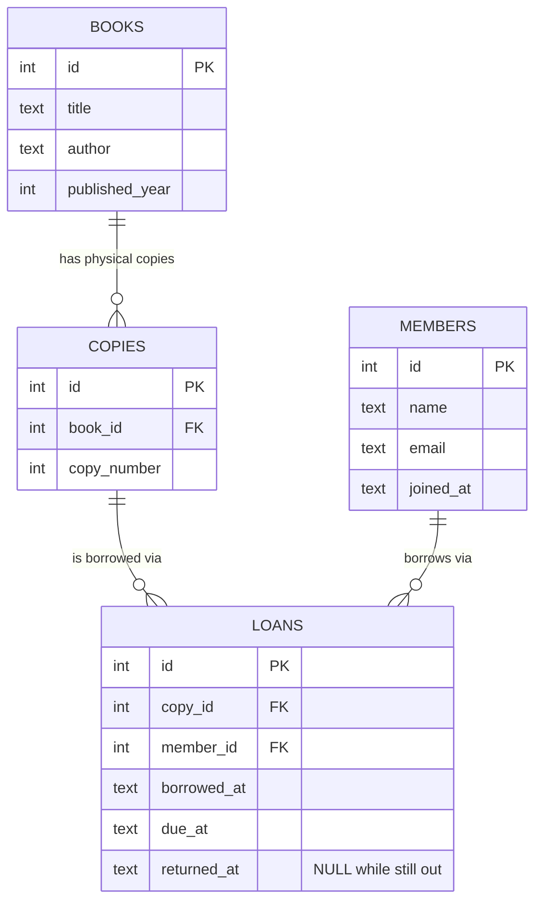

# The data model, explained

This is the document I'd want if I inherited this codebase and had to
change the schema without breaking something I couldn't see. It
explains the shape, names every constraint and what it's actually
preventing, and ends with the two queries that matter most: the one
that's already fast, and the one that would be first to hurt if this
library were ten times bigger.

For how to run the project locally, see `README.md` — this document
assumes it's already running and focuses entirely on the data.

## The shape



Four tables, and the reason there are four and not three is the whole
design:

**`books`** is the abstract work — "Pride and Prejudice," one row,
regardless of how many physical copies the library owns. Nothing about
availability lives here; a book row never changes once its bibliographic
details are correct.

**`copies`** is one physical, borrowable object. A library can own
three copies of the same book, and they get loaned out independently
— copy #2 being out doesn't affect whether copy #1 is available. Every
copy belongs to exactly one book (`book_id`), and `copy_number` just
distinguishes a book's copies from each other (copy 1, copy 2, copy 3
of the same title).

**`members`** is a person who can borrow things. Deliberately thin —
name, email, when they joined. Nothing about what they currently have
out lives here either; that's derived, not stored (see below).

**`loans`** is the join between a copy and a member for one borrowing
period — *not* between a book and a member. That distinction is the
whole point of having `copies` exist separately from `books` at all:
a loan has to say *which physical copy*, because two different copies
of the same book can be out to two different people at once, and the
system needs to know which one is overdue, not just which title.

`returned_at` is `NULL` while a loan is still active and gets a
timestamp when the copy comes back. There is no separate `status`
column on `copies` or `loans` recording "available" / "out" — that
state is entirely derivable from whether a loan with `returned_at IS
NULL` exists for a given copy. Storing that same fact twice (once as a
loan row, once as a status flag) is exactly how the two versions of the
truth drift apart six months later, when someone updates one and
forgets the other.

## Constraints, and what each one actually prevents

A constraint that exists "for safety" without a specific story behind
it is usually removed by the next person who finds it inconvenient.
Here's what each one in this schema is actually for.

| Constraint | Prevents |
|---|---|
| `books.id`, `copies.id`, `members.id`, `loans.id` — `PRIMARY KEY` | Two rows in the same table claiming the same identity; every foreign key below depends on this being unambiguous. |
| `copies.book_id REFERENCES books(id)` | A copy that points at a book that doesn't exist — an orphaned physical item nothing can be found through. |
| `loans.copy_id REFERENCES copies(id)` | A loan for a copy that doesn't exist — a borrowing record for nothing. |
| `loans.member_id REFERENCES members(id)` | A loan attached to a person who was never registered — makes "who has this out" always answerable. |
| `copies(book_id, copy_number) UNIQUE` | Two different physical copies of the same book both being labeled "copy 2" — the inventory-numbering equivalent of two people with the same employee badge number. |
| `members.email UNIQUE` | The same person accidentally (or deliberately) registered as two separate member records — which would silently split their loan history across two identities. |
| `loans(copy_id) UNIQUE WHERE returned_at IS NULL` | **The one that matters most**: a copy being lent to two people at once. Partial — unique only among *active* loans — because a copy legitimately has many loans over its lifetime, just never two unreturned ones simultaneously. This is enforced by the database itself, not application code that checks first and inserts second; a check-then-insert has a race condition between the two steps that this constraint doesn't. See `README.md`, "How double-lending is prevented," for the full reasoning. |

## The query that carries the load, and the index behind it

The one endpoint this whole project was built around:
`GET /members/:id/loans/current` — a member's currently borrowed
books, most recent first.

```sql
SELECT b.title, l.due_at
FROM loans l
JOIN copies c ON c.id = l.copy_id
JOIN books b ON b.id = c.book_id
WHERE l.member_id = ? AND l.returned_at IS NULL
ORDER BY l.borrowed_at DESC
```

Real plan, captured from the seeded database (16,195 loans):

```
SEARCH l USING INDEX idx_loans_member_active_recent (member_id=? AND returned_at=?)
SEARCH c USING INTEGER PRIMARY KEY (rowid=?)
SEARCH b USING INTEGER PRIMARY KEY (rowid=?)
```

The index doing the work:

```sql
CREATE INDEX idx_loans_member_active_recent
  ON loans(member_id, returned_at, borrowed_at DESC);
```

Every step is a `SEARCH`, not a `SCAN` — SQLite jumps straight to this
member's rows instead of checking every loan in the table, and there's
no separate sort step, because `borrowed_at DESC` as the index's third
column means matching rows already come out in the order the query
asks for. `README.md` has the full before/after comparison, including
what the plan looked like before this index existed.

## Which query would fall apart first at ten times the data

Not the one above. That query's cost is bounded by *one member's* loan
history, which stays small no matter how big the library gets — a
member with 40,000 books in the catalog to choose from still only ever
has a handful checked out at once.

The query that scales badly is one that **doesn't have an endpoint
yet, but obviously needs one**: every currently overdue loan,
library-wide — the report library staff would ask for first.

```sql
SELECT m.name, b.title, l.due_at
FROM loans l
JOIN copies c ON c.id = l.copy_id
JOIN books b ON b.id = c.book_id
JOIN members m ON m.id = l.member_id
WHERE l.returned_at IS NULL AND l.due_at < ?
ORDER BY l.due_at ASC
```

Real plan, same seeded database (`node overdue-query-plan.js`
reproduces this):

```
SCAN l USING INDEX idx_one_active_loan_per_copy
SEARCH c USING INTEGER PRIMARY KEY (rowid=?)
SEARCH b USING INTEGER PRIMARY KEY (rowid=?)
SEARCH m USING INTEGER PRIMARY KEY (rowid=?)
USE TEMP B-TREE FOR ORDER BY

min 0.19ms · median 0.20ms · max 0.51ms
(scanning 1,146 active loans out of 16,195 total)
```

Fast right now — 1,146 rows is nothing. But look at what's actually
happening: it's a `SCAN`, not a `SEARCH` (it gets to skip straight to
*active* loans, courtesy of the double-lending index, but then has to
check `due_at` on every single one of those by hand), and it needs a
temporary sort, because nothing indexes `due_at`. Every other query in
this app is either bounded by a `LIMIT`, a single-row primary-key
lookup, or — like the one above — scoped to one member. This is the
only one whose cost is tied to a number that grows with the *whole
library's activity*: more books and more members both mean more
simultaneously active loans, which is exactly the quantity this query
scans in full every time it runs.

At ten times the data — roughly 11,000+ active loans instead of
1,100 — this is still probably under Render's response budget in raw
milliseconds; SQLite is fast. But it's the one query in this schema
whose plan doesn't change for the better as the library grows, and it's
the most likely next thing to actually get built, since "who's
overdue" is the kind of feature a real library obviously needs. If I
were revisiting this schema at ten times the traffic, adding an index
on `loans(due_at) WHERE returned_at IS NULL` — the same partial-index
trick already used for the double-lending constraint, applied to a
different column — is the change I'd make before shipping that
endpoint, not after noticing it was slow in production.

## Reproducing this

```
node seed.js                  # populate the database
node bench.js                 # the member-scoped query, before/after the index
node overdue-query-plan.js    # the overdue-report query analyzed above
```

All three seed their own throwaway database and print real plans and
timings — nothing in this document is asserted without a script that
reproduces it.
